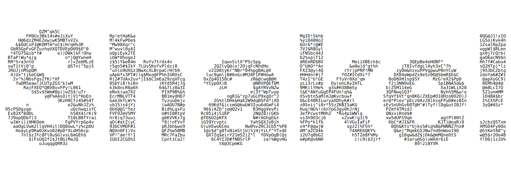

# Shake

Shake your device to refresh with vibration. 
This is a fun pilot project inspired when exploring the web docs for the Device Motion event.

Written in React & TypeScript with Vite.

## Issues

- Doesn't work on iOS & Firefox Android due to inadequate user activation - some permission, privacy thingy (the event is well supported) - It is a proof of concept so it was done rather hasty.
- The Vibration API isn't supported in Firefox Android & Safari, hence all iOS browsers.

### Fun fact

No `UseEffect`, this project was also an opportunity to use React’s `useSynExternalStore` hook - cool!

#### PS

I don't think you would test this on desktop, anyhow, I didn't.
